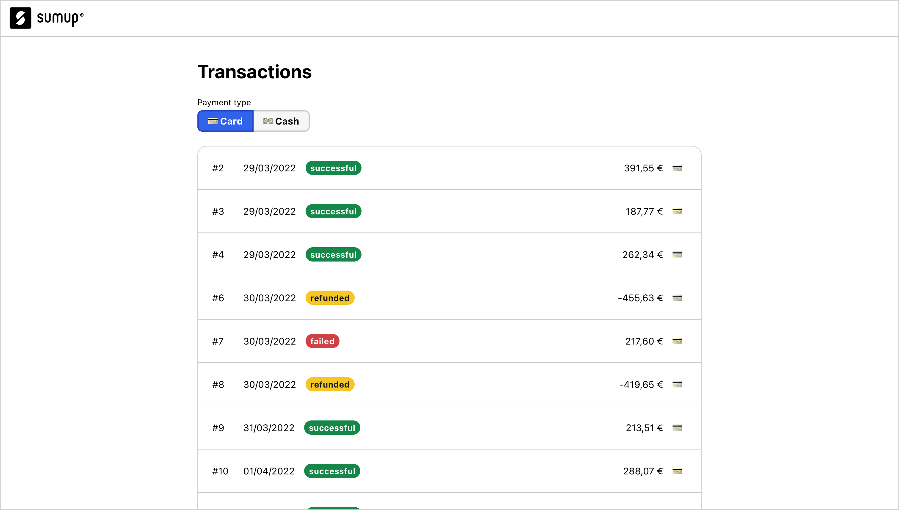
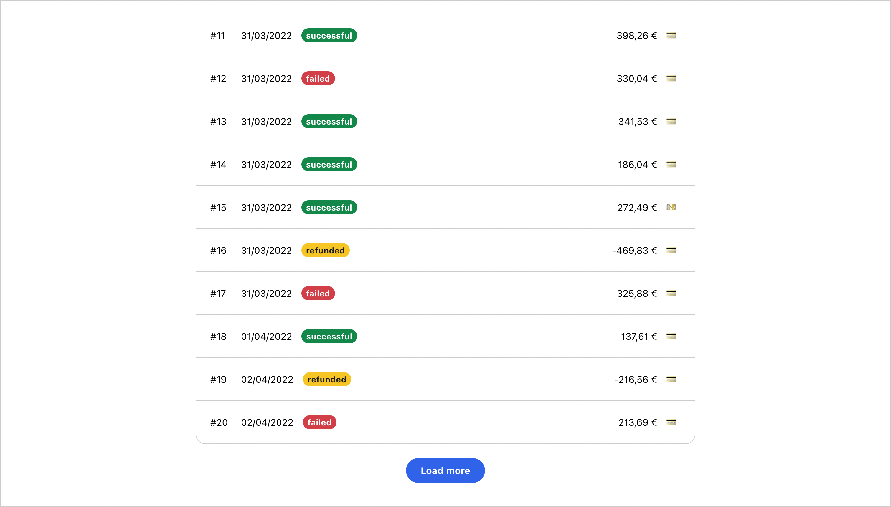
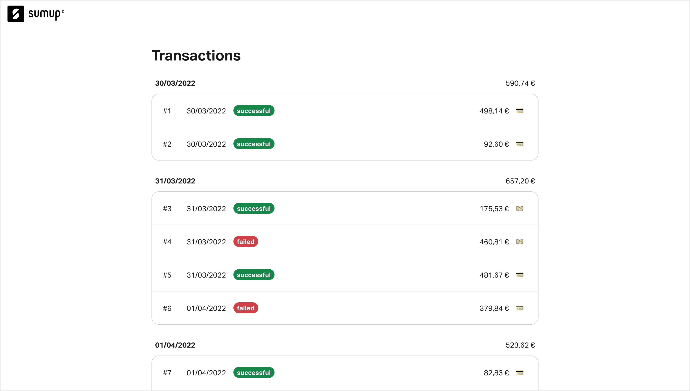

# SumUp's Code Challenge

Welcome to SumUp's code challenge for fullstack engineers! This step of the interview process is meant to give you an idea of some of the challenges you might be working on at SumUp. It enables us to get to know your way of thinking and to evaluate your coding abilities.

We estimate that the challenge shouldn't take more than 3-4 hours. Please read the complete set of instructions before you dive into the code so you don't miss any important information. You can reach out to us anytime if something is unclear.

We hope you enjoy the challenge!

## The tasks

SumUp empowers merchants to get paid for doing what they love. A core feature of our user-facing web dashboard is the _transaction history_ which gives users an overview of their sales. For this coding challenge, we've built a small replica of the transaction history page (you'll find [more details on the app](#getting-started) below).

The app is quite bare-bones right now. Your task is to implement the first two (fictitious) feature requests from our users below. The accompanying screenshots show possible designs for each task, but you're welcome to be creative and come up with your own designs. We want you to focus on two so that you can put as much attention on writing quality code end to end, making both the backend and the frontend robust.

### 1. Filter transactions by payment type

Ana owns a small kiosk selling drinks and snacks in a small town in the north of Brazil. At the end of every workday, she likes to take inventory of the money in her cash register and cross-reference it with her SumUp transaction history to verify that the amount is correct. She finds it tedious to differentiate between cash and card payments, so she shares this feedback with SumUp.

Your task is to implement a user interface control to filter the transactions by payment type. When pressing either 'Card' or 'Cash', only transactions with the respective payment type should be shown.

### 2. Pagination

Bianca and Carmelo run a pizzeria in the heart of Milan, Italy. They've been loyal SumUp customers for some years and have made thousands of sales. Lately, their transaction history is taking a long time to load, so they reach out to SumUp for help.

Your task is to paginate the transaction history. Initially, 20 transactions should be shown. At the bottom of the list, there should be a "load more" button. When pressed, it should load 20 more transactions and append them to the end of the list. The button should be hidden once there are no more transactions to load.

### 3. Group transactions by date (Bonus)

Duncan makes a living as a cab driver in Manchester, UK. His income fluctuates from day to day with weekends being his most profitable days. He would like a way to see at a glance how much he has earned in a day, so he submits a feature request to SumUp.

Your task is to group the transactions by their date and display the total profit for each day. The profit should be calculated by subtracting refunded transactions from successful ones and ignoring failed transactions.

## Getting started

1. **Clone this repository**

2. **Get familiar with the existing code**

   The app is built using:

   - [React](https://reactjs.org/), a library for building user interfaces that's widely used at SumUp
   - [Typescript](https://www.typescriptlang.org/), strongly-typed superset of JavaScript
   - [Next.js](https://nextjs.org/), a "meta" framework for React that abstracts away the build configuration and provides additional server-side capabilities
   - [CSS Modules](https://nextjs.org/docs/app/building-your-application/styling/css-modules), a CSS styling solution to write modular, scoped, and reusable CSS code for components

   The main entry point for the app lives at [`src/app/page.tsx`](./src/app/page.tsx). The data for the transaction history is randomly generated inside [`src/app/api/transactions/route.ts`](./src/app/api/transactions/route.ts) (a [Next.js API route](https://nextjs.org/docs/app/building-your-application/routing/route-handlers)) and available on the `/api/transactions` endpoint when the app is running. 

   Make sure you have Node.js v18+ installed. We recommended using a [Node version manager](https://npm.github.io/installation-setup-docs/installing/using-a-node-version-manager.html) (such as [nvm](https://github.com/nvm-sh/nvm)) that enables you to switch between multiple versions of Node.js.

   Install all dependencies by running `npm i`, then start the app by running `npm run dev`. The app will be available at [localhost:3000](http://localhost:3000) or the next port available if that's in use.

3. **Create a new branch from `main`**

4. **Implement your solution**

Implement [the first two tasks](#the-tasks) above. You can commit the solutions for the task to the same branch. We'd love to see your problem-solving process through your commit messages. If you're unsure about something, take a look at the [frequently asked questions](#frequently-asked-questions) or reach out to us.

5. **Create a pull request**

   Open a pull request (PR) to the `main` branch on this repository. The PR description is a great place to document your thought process and the decisions you've taken while implementing your solution.

6. **Send us your solution**

   Before submitting, please verify that your app runs and that the tests and linter pass. Then, send an email to our recruiter to let them know that you've finished and include a link to your pull request. We'll get back to you in a couple of days with a review and feedback :)

## Our expectations

We expect you to write code that you would be proud to contribute to a shared codebase.

- **Readable** — The code should be easily understood by other humans.
- **Scalable** – The code should be well-structured so it can be extended in the future.
- **Accessible** – The app should be usable by a wide range of users, no matter their (dis)abilities.
- **Reliable** – The app should be well-tested and free of bugs.
- **Performant** – The app should load and run quickly on most devices and network connections.

It's okay if you take some shortcuts, but please leave a note in the code or PR description to let us know.

## Additional tools

There are some additional tools we regularly work with that are outside of the scope of this challenge, but if you have time and familiarity are helpful to see.

- **OpenAPI** - We use this for API specs, and Code Generation
- **Docker** - All our applications are deployed via Kubernetes, so our code is all containerized with Docker

## Frequently asked questions

**Q:** Can I start the project from scratch?\
**A:** No. Please only work on the given tasks, on top of what is already available. You're welcome to make improvements to the existing code though :)

**Q:** Can I implement more than 2 tasks?
**A:** If you have additional time we would prefer to see you focus on the (additional tools)[#additional-tools] section instead of implementing more tasks, but if you are eager feel free to try the third.

**Q:** Should the app be responsive and work on mobile?\
**A:** No. Making tables responsive in an accessible way takes a lot of effort. We want to be respectful of your time which is why we're limiting the scope to wide viewports.

**Q:** Can I install additional dependencies?\
**A:** Yes. However, keep in mind that we're mainly interested in seeing _your_ code ;)

**Q:** Can I come up with my own design for the requested components?\
**A:** Yes. The provided designs are only meant as inspiration, you're free to be creative and use your designs. You can also use our design guidelines and design system, [Circuit UI](https://circuit.sumup.com/).
